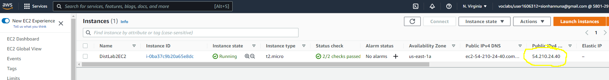

# Accessing an Instance

To access an instance you will need to use ssh. Linux and macOS support this in the terminal. On Windows you can use WSL or PowerShell.

1. Locate the keypair that you downloaded from AWS when you started your instances.

2. Find the IP address of the instance you would like to connect to. This will be shown if you click on a instance from the list you have created. In the example below the ip address is `52.90.29.156`

3. Open a terminal.

4. Copy the keypair to your `~/.ssh` folder using `cp keypair.pem ~/.ssh/keypair.pem` where `keypair.pem` is the path to the downloaded keypair (note -	the keypair generated by AWS is given in a .cer file for macOS. Can be used in exactly the same manner as the .pem)

4. **WARNING MAKE SURE YOU TYPE THIS COMMAND *EXACTLY* AS SHOWN** Set your key to have the correct permissions by running `chmod 0600 ~/.ssh/keypair.pem`. 

5. Use the command `ssh ec2-user@52.90.29.156 -i ~/.ssh/keypair.pem`. Replace the IP address with your IP.

You now have a terminal connected to your AWS instance.

## Coping files

The best way to transfer files between your local machine and the instance is to use a git repo for your work and clone the repo to the AWS instance. To learn how to use git follow [this guide](https://www.ole.bris.ac.uk/bbcswebdav/users/csxdb/pub/git/index.html).

Alternatively, consider using Filezilla:

1.	Download and install FileZilla on your local machine
2.	Open the menu File -> Site Manager
3.	Click on New site, select SFTP as Protocol, fill in Host with your AWS Instance IP and Port with 22
4.	Select Key file as Logon Type, fill in User and Keyfile with ec2-user and your pem key
5.	Connect

## Setting a desktop environment with AWS instance and Amazon Linux

Amazon have published [this handy guide](https://aws.amazon.com/premiumsupport/knowledge-center/ec2-linux-2-install-gui/)
