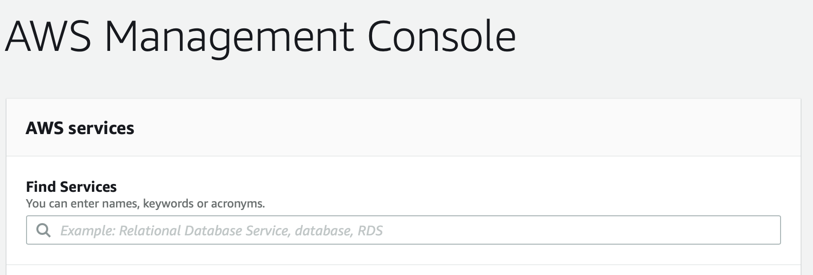
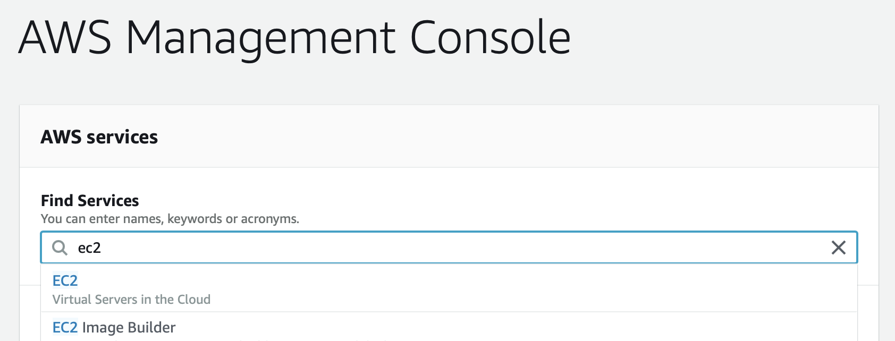
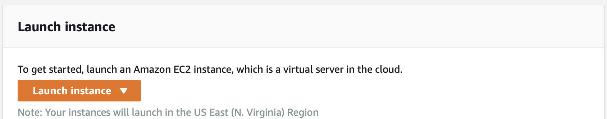
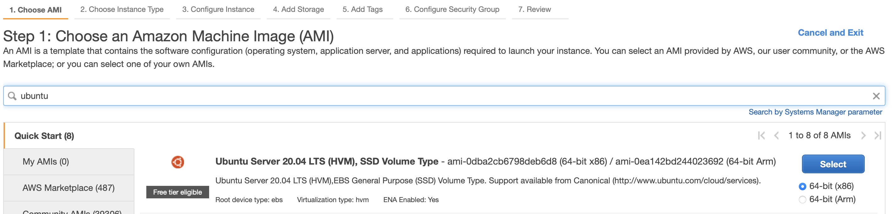
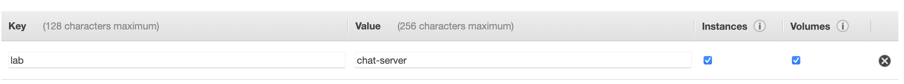

# Creating an AWS Instance 

This will help you setup an instance on AWS.

1. Open the AWS console.

2. Search for ec2 and select it.

3. Click "Launch Instance" 

4. Search for "Ubuntu" and select "Ubuntu Server 20.04" keep x86 selected.

5. You now need to select an instance type. If you are working on labsheets or just testing your coursework, use a t2.micro instance. If you are benchmarking your distributed system use a c4.xlarge instance. Once you have chosen the instance select "next".

6. Most settings on this page **do not** need to be changed, the only one you should worry about is the number of instances to start. Once this has been set, select "next".

7. Select "next" on the storage section. You do not need to change any settings here.

8. Add a tag, choose something that will help you identify the instance in the future, for example a lab name.

9. Leave the security group settings as default and select "review and launch".

10. Now click "launch" this will open a popup box to set the keypair. If you have already got a keypair setup select it, **make sure you have the key downloaded somewhere**. If you cannot find the pre-existing key or do not already have one setup, create one and download it. **Make sure you keep it safe, if you loose it you will not be able to access your instances**.

11. Now click "launch instances", this will start your instances.

12. Follow the [next guide](access-instance.md) to get access to your instance.

13. Once you have access you will need to install Go by following option 1 in [this guide](../go-install/linux.md). 

