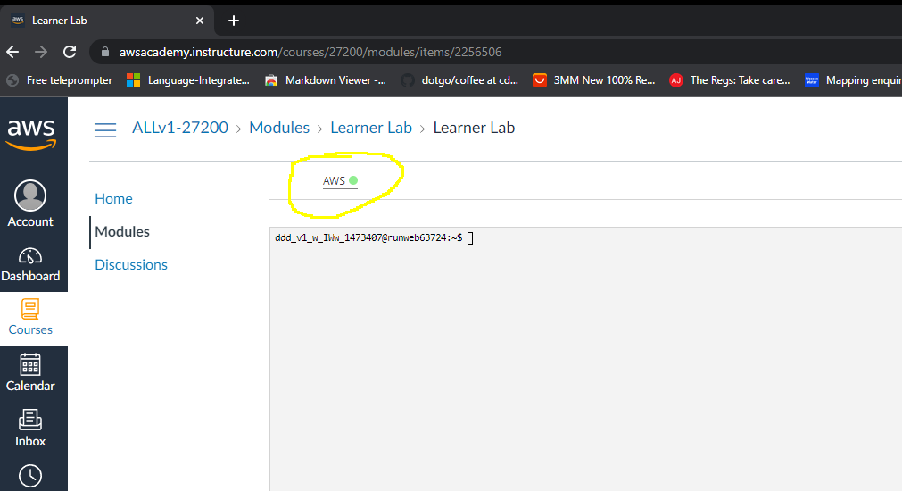

# Creating an AWS Instance 

This will help you setup an instance on AWS (**Just ingore, click OK on pop-ups pertaining to budget).**

* Log into Amazon Academy using the email you were sent and click "Student login":

* Click "Modules" (drawn around by hand):

* Click "Learner Lab"

* Click "Start Lab"

* Click the (now green not red) AWS link (drawn around by hand):

* Click View all services  (drawn around by hand):

* Click EC2 (drawn around by hand):

* Click Launch instance (drawn around by hand):

* Give it a suitable name and Select Amazon Linux 2 AMI (HVM):

* You now need to select an instance type. If you are working on labsheets or just testing your coursework, use a t2.micro instance. If you are benchmarking your distributed system use the largest available -  medium instances (2 vCPU) seem to launch OK (large are not permitted). Once you have chosen the instance select "next".

* Most settings on this page **do not** need to be changed, the only one you should worry about is **creating a key pair** 

* Click Create a new key pair (drawn around by hand):

* Call it something sensible and click create a key pair (note the EC2 instance will have this setup and the browser should automatically download the client side key)

* Note the downloaded key here:

* Leave the security group settings and storage as default 

* Now click "launch instance". This will start your instance.

* Follow the [next guide](access-instance.md) to get access to your instance.

* Once you have access you will need to install Go by following option 1 in [this guide](../go-install/aws.md).
