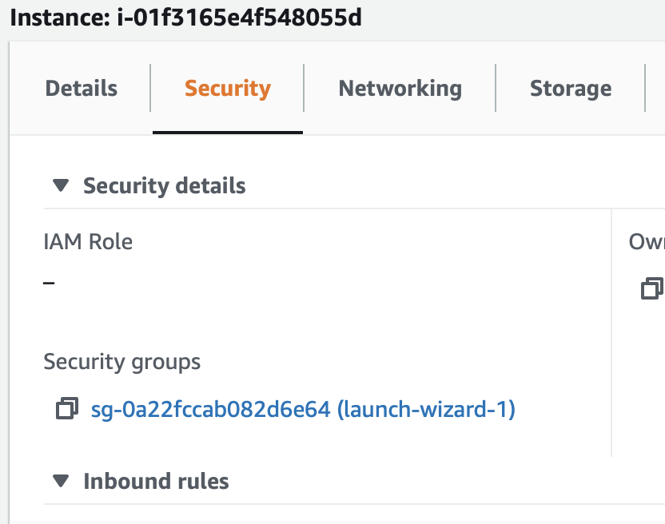
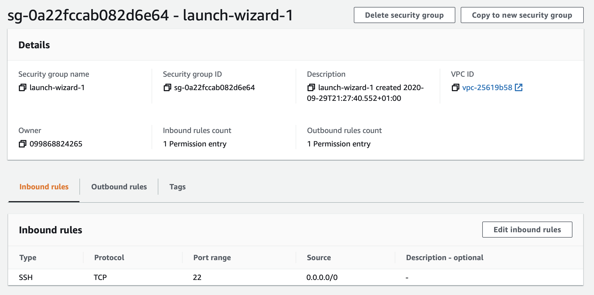
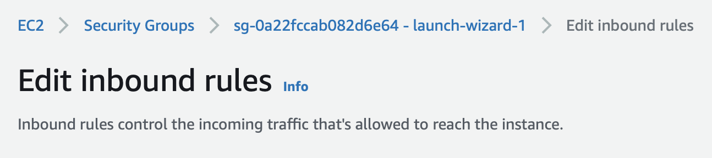
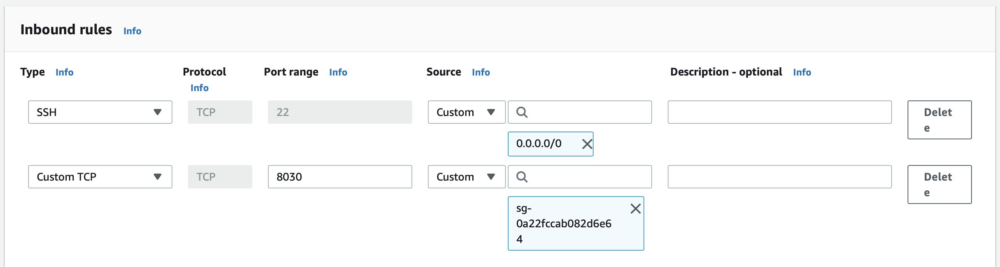

# Opening ports

When you are working on two different machines they will need to be able to communicate between each other. To do this they will need a port opening.

1. Identify the port that you need to open. For example in the *chat server* lab you need to open port `8030`.

2. Select the instance from the list of instances in your account.

3. Go to the security tab.

4. Select the security group, it should load a new page.

5. Click on "Edit inbound rules"

6. Select "Add rule".

7. Set the port range to be the port that you need to open, in the example above it is `8030`.

8. In the source enter the name of the security group you are editing, this should auto-complete. You can find this at the top of the screen. In the example below it is `sg-0a22fccab082d6e64`.

9. The setup should look similar to this:

10. Click "Save rules".
