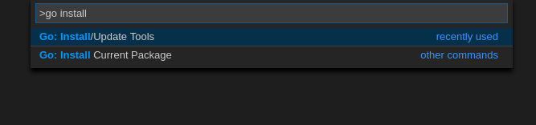
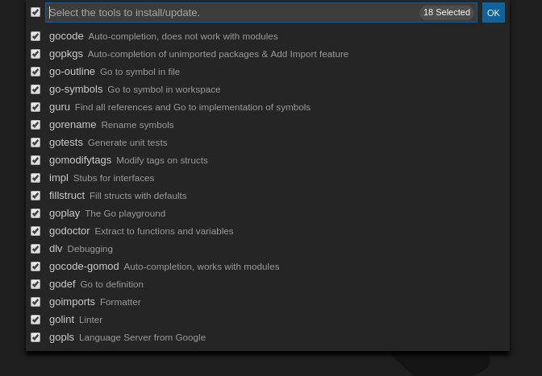
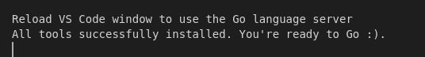

# VSCode

To configure VSCode to work with Go you will need to install a few things.

1. Open VSCode and then the extensions tab on the left (`Ctrl + Shift + X`).

2. Search for `Go` and install the first extension (by Microsoft).

3. Press `Ctrl + Shift + P`, search for `Go: Install/Update Tools`.

4. From the list, select **all** extensions.

5. Wait for installation to finish and **restart VSCode**.  

