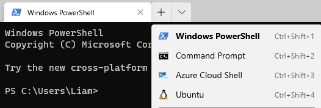

# Setup instructions for Windows

**We recommend using Windows Subsystem for Linux 2 (WSL2). No official support for native Windows will be provided.**

## WSL2

1. Follow the [official instructions here](https://docs.microsoft.com/en-us/windows/wsl/install-win10) to install WSL2. **Do not install WSL1**: some tools will not work correctly. When prompted to install a distribution of your choice, we officially recommend [Ubuntu 20.04 LTS](https://www.microsoft.com/store/apps/9n6svws3rx71).

1. If you already have an existing WSL1 distribution, you can update it to use WSL2 with:
        
    1. `wsl --list --verbose` to print a list of WSL distributions and their versions.
    1. `wsl --set-version DISTRO 2` to update the specified distribution.

1. You can access your distribution via the start menu, e.g. Win + S, then type "Ubuntu".

1. (Optional) Install [Windows Terminal](https://www.microsoft.com/en-gb/p/windows-terminal/9n0dx20hk701). This is not necessary, but provides a better work experience. Once installed, you can access your Linux distribution with the drop-down arrow at the top.  

    

    **Note** that Windows Terminal will automatically open WSL to your Windows home directory. You can change to your Linux home directory with `cd ~`.

1. Follow the [Linux setup guide](./linux.md) to install Go.

## Interacting With WSL

If you're ever lost with WSL, check the [FAQ](https://docs.microsoft.com/en-us/windows/wsl/faq) first.

**Keep in mind that your Windows and WSL file systems are separate**. You can access your Windows files through `/mnt/` if necessary, but you should be developing in the WSL file system.

There are two main ways to develop in WSL: using terminal based editors such as `vim` and `nano`, or you can use Visual Studio Code.  

To use Visual Studio Code:

1. Follow the [Getting Started](https://code.visualstudio.com/docs/remote/wsl#_getting-started) instructions to install Visual Studio Code and the Remote WSL extension. 

1. To connect to WSL, you can either:
    1. Select the Remote Explorer icon on the left of Visual Studio Code and select your distribution.
    1. Or, in a WSL terminal window, navigate to your desired directory and run `code .` 

1. Follow the [Visual Studio Code setup guide](/editors/vscode.md) to install Go tools.

## Graphical Access to WSL2 viva SSH with X forwarding (tricky, but allows you to run IntelliJ with Go plugin natively on WSL2 - facilitating all that IntelliJ goodness)

1.Install XFCE, openssh-server and net-tools by running the following commands in the terminal (select default options when prompted)

```bash
sudo apt-get update 
sudo apt-get install xfce4
sudo apt install net-tools       
sudo apt-get install openssh-server 
```
2.Configure ssh server by editing the sshd_config file

```bash
sudo nano /etc/ssh/sshd_config
```
Set the port to 22:

And PasswordAuthentication to Yes:

3.Start the ssh server

```bash
sudo nano /etc/ssh/sshd_config
```
4.Get the IP address of your WSL2 (see screenshot) 

```bash
ifconfig
```


5.Configure your display for X forwarding by pasting the following into the bottom of your .bashrc file. 
```bash
export DISPLAY=$(awk '/nameserver / {print $2; exit}' /etc/resolv.conf 2>/dev/null):0
export LIBGL_ALWAYS_INDIRECT=1
```
5.Make those changes take effect by typing
```bash
source ~/.bashrc
```

