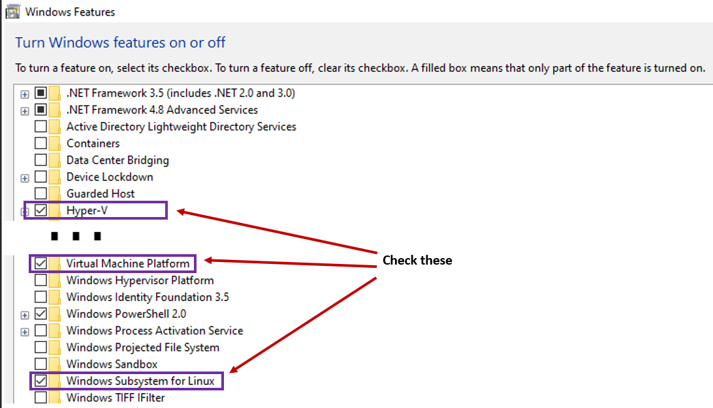

WHEN INSTALLING UBUNTU 22.04 I GOT THIS ERROR:
-----------------------------------
- Error: 0x80370114 The operation could not be started because a required feature is not installed.
- In order to enable the required feature, press start and search Windows Features then mark the following:

- Also take a look at this [Microsoft Guide](https://learn.microsoft.com/en-us/windows/wsl/tutorials/gui-apps)
