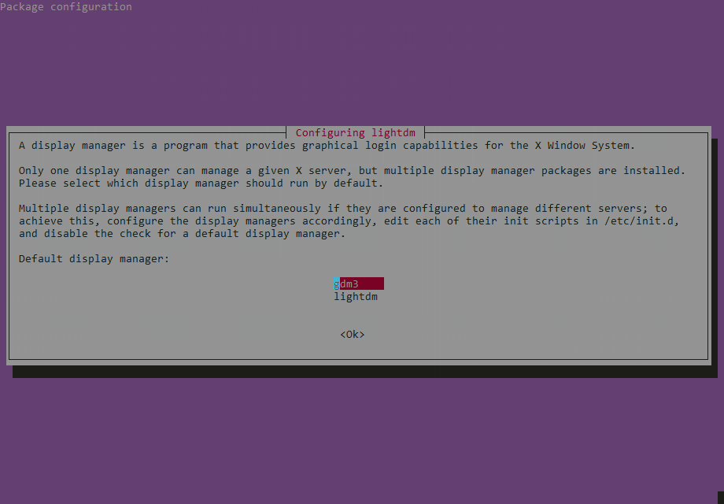
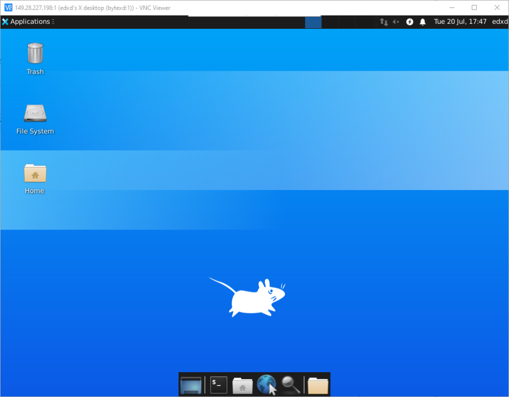

# How to Install & Configure TigerVNC Server on WSL2

## Prerequisites

* WSL2 running Ubuntu 20.04 to which we’ll connect.
* A non-root sudo user
* A VNC Client (also called VNC Viewer) which is the software that you’ll run on your Windows 10 machine and will enable you to control your VNC server. There are some popular VNC viewers that you can choose from. The one I’m using in this tutorial is Real VNC Viewer, but on subsequent testing the [TigerVNC](https://tigervnc.org/) client delivers better resolution.

# Too long to read - watch the video

[Associated Video Tutorial](https://web.microsoftstream.com/video/9365b0ef-9cb7-46a4-9341-e3c0cb7f6c06)

## Step 1: Install a Desktop Environment

For this particular post, we will install the XFCE desktop environment. It is fast, stable, and easy to use.

Open Ubuntu 20.04 in WSL2 and execute the following command to update your package index:

```bash
sudo apt update
```

Next we’ll run the following command to install xfce4 and xfce4-goodies:

```bash
sudo apt install xfce4 xfce4-goodies
```

xfce4-goodies is an additional package for XFCE Desktop Environment, which brings a lot more advanced enhancement.

You will see a prompt to select a display manager for your newly installed XFCE Desktop Environment during the installation.



Select any display manager and press Enter (I chose lightdm).

## Install TigerVNC on Ubuntu

To install TigerVNC execute the command below:

```bash
sudo apt install tigervnc-standalone-server
```

After a successful installation, we need to perform the initial VNC configuration, set up a VNC access password and initialize the VNC server.

Execute the command below to initialize the VNC server instance and set up a password. Assuming you are acting as a non-root sudo user, do NOT execute this command with sudo:

```bash
vncserver
```
*Produces the following output:*
```bash
You will require a password to access your desktops.

Password:
Verify:
```

* **Note:** The password must be between 6 – 8 characters long. The system will automatically truncate any password longer than eight characters. For example, if you enter a password like startup2233, it will be truncated to startup2.

After setting up the password, you will get a prompt to set a View-Only password. That means anybody who accesses the VNC server with a view-only password will not be able to VNC desktop with either Mouse or Keyboard.

For this particular post, we won’t set up a view-only password. I will just type N and hit Enter.

```bash
Would you like to enter a view-only password (y/n)? N
/usr/bin/xauth:  file /home/edxd/.Xauthority does not exist

New 'bytexd:1 (edxd)' desktop at :1 on machine bytexd

Starting applications specified in /etc/X11/Xvnc-session
Log file is /home/edxd/.vnc/bytexd:1.log

Use xtigervncviewer -SecurityTypes VncAuth -passwd /home/edxd/.vnc/passwd :1 to connect to the VNC server.
```

We can see this process lists the connection information for our VNC server from the message above. Additionally, it started the VNC server at port 5901, which is the display port. This port (5901) is referred to as :1.

If you create additional VNC server instances, they will be presented as port 5902 as :2, port 5903 as :3, and so on.

Up to this point, our VNC server is up and running. However, it cannot give us access to a graphical interface since it’s not configured to launch our XFCE desktop environment;

* **Tip:** If you ever want to change the VNC password or the view-only password, execute the command below:

```bash
vncpasswd
```

## Step 3: Configure the VNC server
Up to this point, we have successfully installed the VNC server and even set up a password.

Now we need to configure the commands that will be executed by the server every time we start a VNC instance.

One main goal is telling VNC which Desktop Environment to connect and use – in this case, XFCE.

To get started, let’s kill the running VNC instance that we launched above running on port 5901. Execute the command below:

```bash
vncserver -kill :1
```
*Produces the following output:*
```bash
Killing Xtigervnc process ID 28634... success!
```

If another instance were running on another port, say 5902 or 5903, we would execute the commands vcnserver -kill :2 and vncserver -kill :3, respectively.

To configure VNC, we will need to create a file called xstartup file in the .vnc folder under the home directory (~/.vnc/xstartup). This is where we’ll configure what desktop environment we want the VNC server to use.

* In my case, TigerVNC does not create the ~/.vnc/xstartup file by itself. If in your case it does, then you can just back up the existing one by running mv ~/.vnc/xstartup ~/.vnc/xstartup.bak, and create a new file.

Now, let’s create and open a new xstartup file with the nano editor. Execute the commands below:

```bash
nano ~/.vnc/xstartup
```

Add the lines below on the editor (see video if this is confusing):

```bash
#!/bin/sh
xrdb $HOME/.Xresources
startxfce4 &
```

Save the file (Ctrl + O, then Enter) and Exit (Ctrl + X). Now let’s go line by line and explain the code above:

* xrdb $HOME/.Xresources: This line tells the VNC server to read the .Xresources file where users can make changes on the graphical desktop general settings like fonts, color, etc.
*startxfce4 &: This line tells VNC which Desktop Environment to launch. startxfce4 is a script responsible for starting an Xfce session.

Lastly, we need to make this file executable. Run the command below:

```bash
chmod +x ~/.vnc/xstartup
```

Once done, proceed to restart the VNC server with the command below.

```bash
vncserver -localhost no :1
```

*Produces the following output:*
```
New 'bytexd:1 (edxd)' desktop at :1 on machine bytexd

Use xtigervncviewer -SecurityTypes VncAuth -passwd /home/edxd/.vnc/passwd :1 to connect to the VNC server.
```

The above command launches a VNC server instance on port 5901.

*Why we used -localhost no
*By default, TigerVNC accepts connection only from 127.0.0.1 or localhost, for security reasons. Since we’re using WSL2, which has its own ip address we need to add this extra argument.

Let’s test the VNC server.

## Connecting to your VNC Remote Desktop

Launch your VNC Client (or VNC Viewer) application on your local machine and connect to the VNC server using server_ip_address:1 or server_ip_address:5901.

In my case, I will use 172.28.227.198:1, and my VNC Client is Real VNC Viewer, but try TigerVNC client first.



From the image above, you can now see our VNC server is well configured, and we can access it from our local machine.

Close the VNC client desktop session and kill the VNC instance on the server using the command below:

```bash
vncserver -kill :1
```
